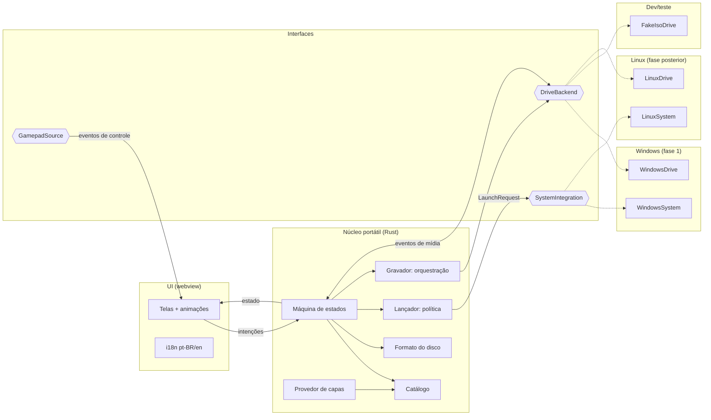
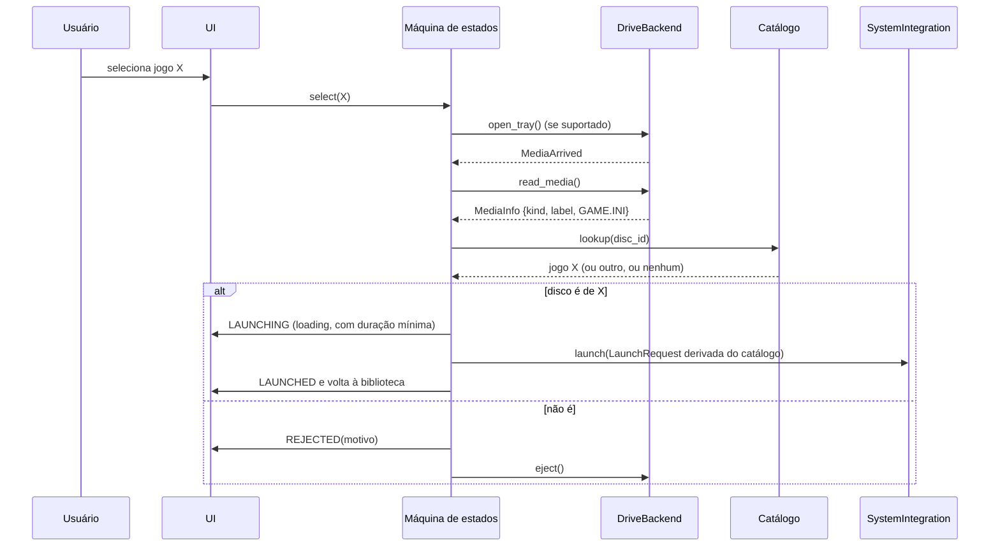

# Arquitetura

Este documento descreve o nível conceitual. Nomes de módulos são ilustrativos; nada aqui define estrutura de crates nem de pastas.

## Componentes

| Componente | Responsabilidade | Portátil? |
|---|---|---|
| **UI (Tauri, frontend web)** | Biblioteca, telas de estado, animações, navegação por controle, i18n. Não toma decisões: renderiza o estado e envia intenções ([UI-CONTRACT](UI-CONTRACT.md)). | Sim, com ressalvas de webview ([PLATFORMS](PLATFORMS.md)) |
| **Máquina de estados** | Única dona do estado da tela. Recebe intenções da UI e eventos do drive e decide as transições ([UX-STATES](UX-STATES.md)). | Sim |
| **Catálogo** | Jogos, discos associados e configurações. Leitura, escrita atômica, exportação e importação ([CATALOG-SPEC](CATALOG-SPEC.md)). | Sim |
| **Formato do disco** | Parser e gerador do `GAME.INI`, com regras de validação e geração do label ([DISC-FORMAT](DISC-FORMAT.md)). | Sim |
| **Lançador (política)** | Transforma uma entrada do catálogo em uma `LaunchRequest` (URI Steam ou executável + lista de argumentos). Não executa nada. | Sim |
| **Camada de drive** | Interface `DriveBackend`: eventos de mídia, leitura, gaveta, gravação e apagamento ([DRIVE-LAYER](DRIVE-LAYER.md)). | Interface sim; implementações não |
| **Gravador** | Monta a imagem (`GAME.INI` + label) e orquestra a gravação via `DriveBackend` ([BURNING](BURNING.md)). | Orquestração sim; gravação física fica no backend |
| **Integração com o sistema** | Interface `SystemIntegration`: executar a `LaunchRequest`, abrir URI, descobrir a Steam, foco e janela, armazenamento de segredo (chave de API). | Interface sim; implementações não |
| **Entrada de controle** | Fonte de eventos de gamepad: Gamepad API na webview **ou** leitura no Rust (`gilrs`) enviada à UI. A escolha depende do spike [W1](RISKS-AND-SPIKES.md#w1-gamepad-no-webview2). | Depende da escolha |
| **Provedor de capas** | Capas locais (cache da Steam, imagem do usuário) e serviço online opcional ([ADR-0015](adr/0015-i18n-e-capas-online-opcionais.md)). | Parcial (os caminhos da Steam variam) |

## Fronteira portátil e plataforma

Regra: **nada dentro do núcleo importa API de sistema operacional.** Qualquer chamada Win32, COM, D-Bus ou ioctl fica numa implementação de `DriveBackend` ou `SystemIntegration`.

## Fluxo principal: jogar

Pontos-chave:

- A `LaunchRequest` é derivada **somente** do catálogo. Do disco, o fluxo usa apenas o `id` ([SECURITY](SECURITY.md)).
- A duração mínima do loading é cronometrada pelo núcleo (máquina de estados), não pelo lançador; a UI só ajusta a animação ao tempo ([ADR-0016](adr/0016-tela-de-loading-duracao-minima.md), [UI-CONTRACT](UI-CONTRACT.md#tempo)).
- A detecção do fim do jogo não faz parte da fase 1 ([OPEN-QUESTIONS Q6](OPEN-QUESTIONS.md#q6-detectar-o-fim-do-jogo)).

## Fluxo de cadastro e gravação

Ver [BURNING](BURNING.md#fluxo).

## Dados em repouso

| Dado | Onde | Observação |
|---|---|---|
| Catálogo e configurações | Perfil do usuário (diretório de dados do app) | Formato em aberto ([CATALOG-SPEC](CATALOG-SPEC.md#formato-em-aberto)) |
| Capas baixadas ou escolhidas | Diretório de dados do app | Copiadas para dentro do app, sem referência a caminhos externos voláteis (recomendação) |
| Chave de API de capas | Armazenamento de segredo do SO (recomendado) | [OPEN-QUESTIONS Q8](OPEN-QUESTIONS.md#q8-onde-guardar-a-chave-de-api) |
| ISOs do drive falso | Pasta configurada, só em modo dev | [DRIVE-LAYER](DRIVE-LAYER.md#fakeisodrive) |
