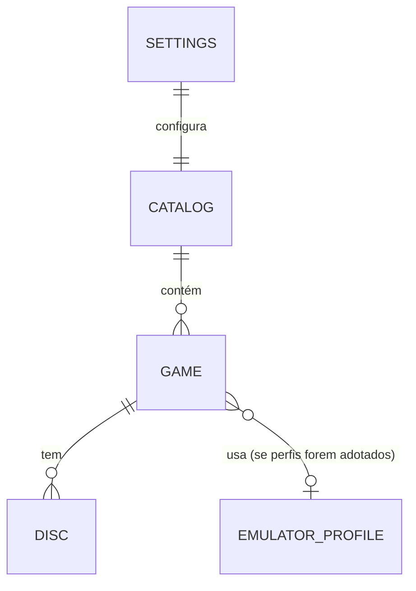

# Especificação do catálogo

O catálogo é a **única** fonte do que é executado ([ADR-0006](adr/0006-catalogo-local-define-execucao.md)). Fica local, no perfil do usuário, e é editável apenas pelo usuário (via app ou, se o formato permitir, à mão).

Os campos abaixo são **conceituais**. Nomes finais e serialização dependem do formato, que está em aberto.

## Entidades

### Game

| Campo | Tipo | Obrigatório | Observação |
|---|---|---|---|
| `game_id` | UUID | sim | Identidade interna do jogo. Diferente de `disc_id`. |
| `name` | texto | sim | Nome exibido |
| `kind` | `steam` \| `custom` | sim | [ADR-0007](adr/0007-tipos-de-jogo.md) |
| `steam.app_id` | inteiro positivo | se `steam` | Validado como número antes de montar a URI |
| `custom.executable` | caminho absoluto | se `custom` | Escolhido pelo usuário |
| `custom.args` | **lista** de strings | não | Lista, nunca string única ([SECURITY](SECURITY.md#r3-execução-sem-shell)) |
| `custom.working_dir` | caminho absoluto | não | Padrão: pasta do executável (proposta) |
| `custom.requires_elevation` | booleano | não | Depende do spike [W7](RISKS-AND-SPIKES.md#w7-lançamento-de-processos) |
| `cover` | referência local | não | Arquivo copiado para os dados do app |
| `cover_source` | `steam_cache` \| `user_file` \| `online` \| `none` | não | Proveniência, para exibir e reprocessar |
| `spine_color` | cor | não | Calculada pelo backend ao importar/trocar a capa ([FRONTEND-DESIGN §3.1](FRONTEND-DESIGN.md#31-cor)) |
| `discs` | lista de Disc | não | Um jogo pode existir sem disco (ainda não gravado) |

### Disc

| Campo | Tipo | Observação |
|---|---|---|
| `disc_id` | UUID | O mesmo gravado no `GAME.INI`. **Único no catálogo inteiro.** |
| `label` | texto | Rótulo gravado (informativo) |
| `media` | `cd-r` \| `cd-rw` \| `iso` \| `unknown` | `iso` quando gravado/adotado com o backend falso ([DRIVE-LAYER](DRIVE-LAYER.md#tipos)) |
| `created_at` | data/hora | Gravação ou adoção |
| `origin` | `burned` \| `adopted` | [ADR-0014](adr/0014-um-jogo-n-discos-e-adocao.md) |
| `note` | texto | Livre (ex.: "cópia reserva") |

### Settings

| Campo | Valores | Padrão |
|---|---|---|
| `drive` | identificador da unidade escolhida | Única unidade óptica, se houver só uma |
| `on_disc_insert` | `focus` \| `launch` | `focus` ([ADR-0013](adr/0013-disco-sem-selecao-e-rearme.md)) |
| `loading_min_ms` | inteiro ≥ 0 | "alguns segundos" (valor exato em aberto, [Q11](OPEN-QUESTIONS.md#q11-timeouts)) ([ADR-0016](adr/0016-tela-de-loading-duracao-minima.md)) |
| `locale` | `pt-BR` \| `en` \| sistema | sistema ([ADR-0015](adr/0015-i18n-e-capas-online-opcionais.md)) |
| `window_mode` | `windowed` \| `fullscreen` | [Q20](OPEN-QUESTIONS.md#q20-modo-de-janela-padrão) |
| `covers_online.enabled` | booleano | `false` |
| `covers_online.api_key` | **referência** a segredo | não armazenada no catálogo (recomendação, [Q8](OPEN-QUESTIONS.md#q8-onde-guardar-a-chave-de-api)) |

## Invariantes

1. `disc_id` é único no catálogo. Um disco pertence a exatamente um jogo.
2. Nenhum campo do catálogo é preenchido a partir do disco, exceto `disc_id` na adoção (por ação explícita, associando a um jogo existente escolhido pelo usuário).
3. Escrita atômica (arquivo temporário + troca) para não corromper o catálogo em caso de queda. Mecanismo exato: detalhe de implementação.
4. Esquema versionado, com migração explícita entre versões.
5. Remover um jogo remove também suas associações de disco; esses discos passam a ser `UNKNOWN` e podem ser adotados depois ([UX-STATES](UX-STATES.md#telas-de-gestão)).
6. A exportação contém jogos, discos e configurações portáveis, sem segredos. Regras de importação: [Q19](OPEN-QUESTIONS.md#q19-importar-estante).

## Tipos de jogo

| Tipo | Lançamento | Importação |
|---|---|---|
| `steam` | `steam://run/<app_id>`. A Valve documenta `run` e também `rungameid` e `launch` ([Valve Developer Community](https://developer.valvesoftware.com/wiki/Steam_browser_protocol)). A escolha entre eles é do spike [W6](RISKS-AND-SPIKES.md#w6-integração-com-a-steam). | Ler bibliotecas instaladas (`libraryfolders.vdf` + `appmanifest_*.acf`), spike [W6](RISKS-AND-SPIKES.md#w6-integração-com-a-steam) |
| `custom` | Executável + lista de argumentos + diretório de trabalho, sem shell | Manual (seletor de arquivo) |

## Perfis de emulador (exploração, **sem decisão**)

Problema: vários jogos usam o mesmo emulador e mudam só a ROM. Sem perfis, cada jogo repete executável e argumentos.

| Opção | Descrição | Prós | Contras |
|---|---|---|---|
| A. Sem perfis | Cada jogo `custom` tem executável + args completos | Simples; zero indireção | Repetição; trocar a versão do emulador obriga a editar N jogos |
| B. Perfis | Perfil = executável + template de args com um marcador de ROM (ex.: `{rom}`) como **elemento da lista**. O jogo referencia o perfil e informa o caminho da ROM. | Sem repetição; atualização central | Indireção; precisa definir as regras do marcador |
| C. Híbrido | B, com opção de sobrescrever os args por jogo | Flexível | Mais superfície para testar |

Restrições que qualquer opção deve respeitar:

- A substituição do marcador acontece **dentro de um elemento da lista de argumentos**, nunca por concatenação numa linha de comando ([SECURITY](SECURITY.md#r3-execução-sem-shell)).
- O caminho da ROM vem do catálogo, nunca do disco.
- Launchers de terceiros (que abrem outro processo e saem) são tratados como `custom` comum. Não há promessa de rastreá-los.

Critério de escolha: número de jogos por emulador na biblioteca real do autor e custo de testar o marcador. Ver [Q4](OPEN-QUESTIONS.md#q4-perfis-de-emulador).

## Formato em aberto

Decisão em "tentativa e teste" ([ADR-0011](adr/0011-decisoes-em-tentativa-e-teste.md)).

| Opção | Edição à mão | Atomicidade | Evolução de esquema | Backup / diff | Observação |
|---|---|---|---|---|---|
| JSON único | Boa | Arquivo inteiro (temp + troca) | Campo de versão + migração | Excelente (um arquivo, texto) | Mais simples; sem comentários |
| JSON por jogo (pasta) | Boa | Por arquivo | Idem | Bom (muitos arquivos) | Conflitos menores se o usuário sincronizar a pasta por conta própria |
| TOML | Muito boa (comentários) | Arquivo inteiro | Idem | Excelente | Listas aninhadas (discos, args) ficam verbosas |
| SQLite | Ruim (precisa de ferramenta) | Transacional nativo | Migrações SQL | Arquivo binário | Robusto; opaco para o usuário |

Critérios, em ordem: (1) integridade (não corromper), (2) exportação e backup triviais, (3) editável sem o app em caso de emergência, (4) simplicidade de implementação. Recomendação provisória em [Q3](OPEN-QUESTIONS.md#q3-formato-do-catálogo).

## Perda e recuperação

Sem catálogo, os discos ficam anônimos: o `id` sozinho não diz o que lançar. Mitigações:

| Mitigação | Tipo |
|---|---|
| Exportar e importar o catálogo (arquivo único, sem segredos) | Requisito da fase 1 |
| Backup automático local ao salvar (últimas N versões) | Proposta |
| `name` no `GAME.INI` + rótulo legível: o humano sabe de qual jogo é o disco | Decidido ([ADR-0012](adr/0012-game-ini-minimo-e-label-informativo.md)) |
| **Adotar disco**: associar um `id` desconhecido a um jogo, por ação explícita | Decidido ([ADR-0014](adr/0014-um-jogo-n-discos-e-adocao.md)) |
| Conta em nuvem | Fora da fase 1 ([Q5](OPEN-QUESTIONS.md#q5-conta-em-nuvem)) |

Catálogo ilegível no boot: o app **não sobrescreve** o arquivo. Mostra erro e oferece restaurar um backup ou começar vazio (preservando o arquivo corrompido ao lado).
