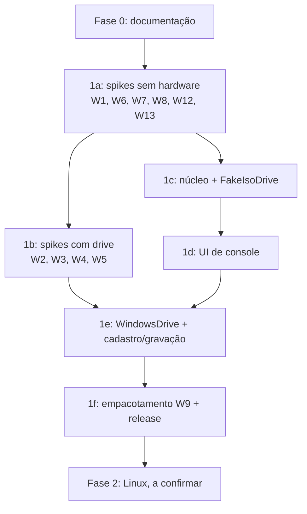

# Roadmap

Ordem sugerida, sem datas. Cada fase só começa com os critérios de saída da anterior cumpridos, ou com o risco aceito explicitamente.

| Fase | Conteúdo | Critério de saída |
|---|---|---|
| **0** | Esta documentação, com revisão independente aplicada. Licença ([ADR-0017](adr/0017-licenca-mit-apache.md)) e nome ([ADR-0020](adr/0020-nome-insert-disc.md)) definidos. | Primeiro commit |
| **1a** | Spikes que não dependem do drive: **W1 gamepad** (primeiro), W13 desempenho 3D, W8 foco, W7 processos, W6 Steam, W12 ISO | W1 decidido (Gamepad API ou `gilrs`) e ADR escrita; W13 dentro da meta |
| **1b** | Comprar o drive ([HARDWARE-AND-MATERIALS](HARDWARE-AND-MATERIALS.md)). Spikes W2, W3 e W4 com triagem por ISO e confirmação no drive; W5 com CD-RW e depois um CD-R | Mecanismos de detecção e gravação escolhidos |
| **1c** | Núcleo: catálogo (formato decidido, [Q3](OPEN-QUESTIONS.md#q3-formato-do-catálogo)), máquina de estados, `GAME.INI`, política de lançamento, `FakeIsoDrive` com todos os cenários de [TESTING-WITH-ISO](TESTING-WITH-ISO.md#cenários); contrato [UI-CONTRACT](UI-CONTRACT.md) | Todos os cenários do drive falso passam; W11 (perda do catálogo) validado |
| **1d** | UI conforme [FRONTEND-DESIGN](FRONTEND-DESIGN.md): biblioteca, estados, loading, navegação por controle, i18n pt-BR/en, janela e tela cheia | Fluxo "jogar" completo por controle, no drive falso |
| **1e** | `WindowsDrive`; cadastro com gravação e apagamento; adoção; exportação e backup | Fluxo completo no hardware real |
| **1f** | Instalador, assinatura (ou alternativa), checksums, primeiro release | Instalação limpa numa máquina sem ambiente de dev |
| **2** | Linux (L1–L8), incluindo gamescope. **A confirmar.** | — |

Capas online ([W10](RISKS-AND-SPIKES.md#w10-capas-online)) podem entrar em qualquer ponto depois de 1d, por ser opcional.
