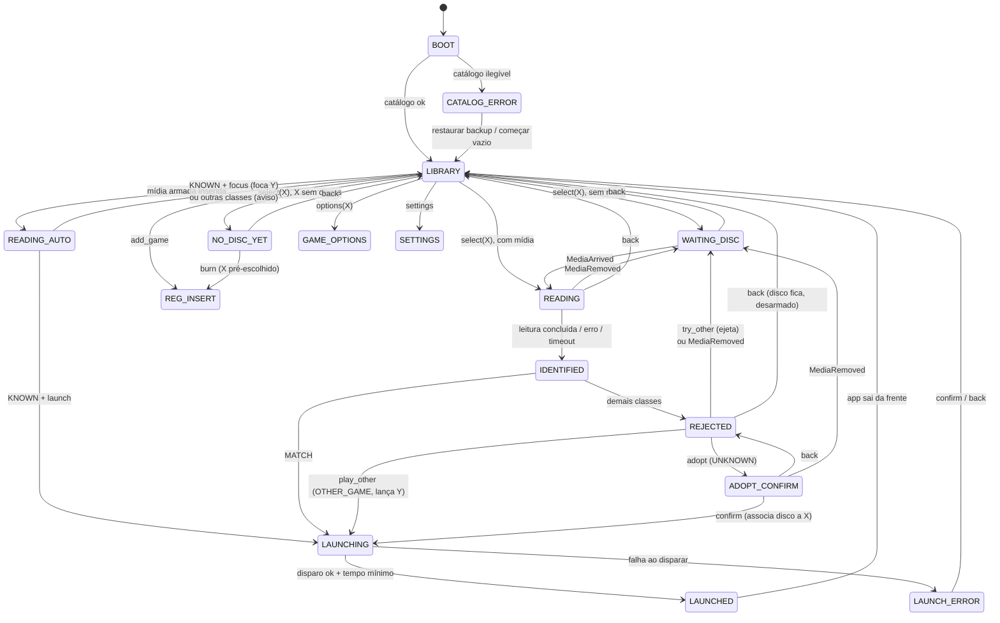
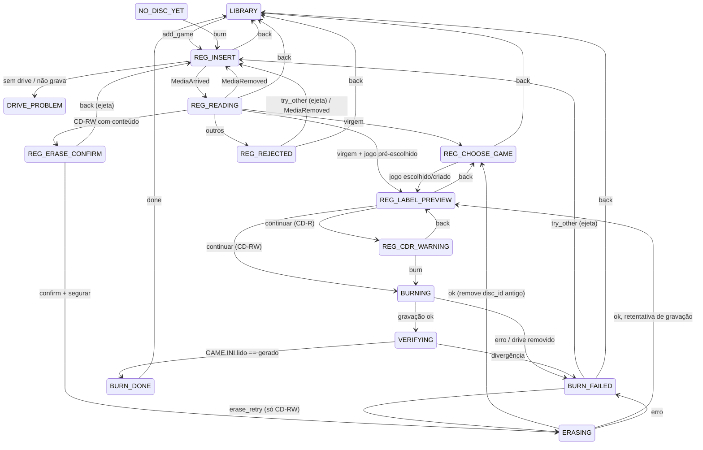

# Estados da interface

A máquina de estados vive no núcleo e é a única dona do estado da tela ([ARCHITECTURE](ARCHITECTURE.md)). A UI renderiza o estado recebido e envia intenções ([UI-CONTRACT](UI-CONTRACT.md)).

- **Textos visíveis** são referenciados aqui por chave de i18n (`reject.blank` etc.). A fonte única dos textos é a [FRONTEND-DESIGN §9](FRONTEND-DESIGN.md#9-textos-pt-br--en).
- **Visual** de cada estado: [FRONTEND-DESIGN §6](FRONTEND-DESIGN.md#6-telas-por-estado).

## Conceitos transversais

| Conceito | Definição |
|---|---|
| **Seleção explícita** | O usuário escolheu o jogo X na biblioteca. Com o disco de X presente, X lança **sempre**, mesmo com o disco desarmado ([ADR-0013](adr/0013-disco-sem-selecao-e-rearme.md)). |
| **Armado / desarmado** | Estado da mídia presente. **Só é armada a mídia inserida com o app em `LIBRARY`.** Mídia presente no boot, inserida em qualquer outro estado, ou já usada num lançamento (automático **ou** por seleção) fica desarmada. Remover a mídia zera o estado. Mídia desarmada nunca dispara nada automaticamente. |
| **Deduplicação** | `MediaArrived` repetido com mídia já presente é ignorado ([DRIVE-LAYER](DRIVE-LAYER.md#eventos)). |
| **Modo de disco sem seleção** | `on_disc_insert`: `focus` (padrão) ou `launch` ([ADR-0013](adr/0013-disco-sem-selecao-e-rearme.md)). Só vale para mídia armada. |
| **Loading** | Todo lançamento passa por `LAUNCHING`, que dura no mínimo `loading_min_ms` ([ADR-0016](adr/0016-tela-de-loading-duracao-minima.md)). O núcleo cronometra; a UI ajusta a animação ao tempo ([UI-CONTRACT](UI-CONTRACT.md#tempo)). |
| **Rejeição mantém o disco** | Um disco rejeitado **não** é ejetado automaticamente. O app ejeta ao escolher "Tentar outro disco" ([ADR-0019](adr/0019-rejeicao-mantem-disco-e-atalhos.md)). |
| **Foco de janela** | Entrada de controle é ignorada enquanto a janela do app não tem foco (o jogo está por cima) ([SECURITY R10](SECURITY.md#r10-entrada-só-com-foco)). |
| **Drive ausente** | `DriveRemoved`, ou nenhum drive configurado, leva a `DRIVE_PROBLEM` a partir de qualquer estado que dependa do drive (tabela no fim). |

## Classificação de mídia

Resultado de `read_media` + consulta ao catálogo. Depende do **contexto**: com jogo esperado X (seleção ou cadastro) ou sem jogo esperado (inserção automática na biblioteca).

| Classe | Condição | Com X esperado | Sem X (automático) |
|---|---|---|---|
| `MATCH` | `id` associado a X | lança X | — |
| `KNOWN` | `id` associado a Y (sem X) | — | `focus`: foca Y · `launch`: lança Y |
| `OTHER_GAME` | `id` associado a Y ≠ X | rejeita, oferece "Jogar Y" | — |
| `UNKNOWN` | `GAME.INI` válido, `id` fora do catálogo | rejeita, oferece adotar | aviso `toast.unknown` |
| `LEGACY_GAME_INI` | INI do Reset Floppy Game System (sem `[disc]`, com chaves do original) | rejeita | aviso |
| `NO_GAME_INI` | CD de dados sem `GAME.INI` | rejeita | aviso |
| `INVALID_GAME_INI` | INI fora da gramática ([DISC-FORMAT](DISC-FORMAT.md#regras-de-leitura)) | rejeita | aviso |
| `BLANK` | Mídia virgem | rejeita | aviso |
| `AUDIO` | CD de áudio ou misto sem dados legíveis | rejeita | aviso |
| `READ_ERROR` | Falha de leitura ou timeout | rejeita | aviso |

No cadastro, a mesma leitura é interpretada pela tabela da seção [Cadastro](#cadastro-e-gravação).

## Diagrama: jogar

## Tabela: jogar

Coluna **A** = ação primária (botão A / Enter); **B** = voltar (botão B / Esc). "—" = inativo.

| Estado | Mostra | O app faz | A | B | Outras saídas |
|---|---|---|---|---|---|
| `BOOT` | Splash | Carrega catálogo e configurações, inicia o backend, registra mídia presente como desarmada | — | — | `LIBRARY`, `CATALOG_ERROR` |
| `CATALOG_ERROR` | `catalog.error.*` + lista de backups | **Não** sobrescreve o arquivo; preserva o corrompido ao lado ([CATALOG-SPEC](CATALOG-SPEC.md#perda-e-recuperação)) | ação em foco (restaurar / começar vazio) | — | `LIBRARY` |
| `LIBRARY` | Estante | Aguarda intenção; em mídia armada, vai a `READING_AUTO` | `select(X)` | — | X: `add_game`; Y: `options(X)`; Menu: `settings` |
| `READING_AUTO` | Estante inalterada (sem tela própria) | Lê e classifica em segundo plano | — | — | `LIBRARY` (+ foco ou aviso), `LAUNCHING` |
| `NO_DISC_YET` | Caixa aberta, `nodisc.title` | — | `burn` | `LIBRARY` | — |
| `WAITING_DISC` | Caixa aberta com bandeja vazia, `wait.title` + `wait.tray_*` | `open_tray()` se `capabilities.tray_open = yes` | `retry_tray` (se suportado) | `LIBRARY` | `READING` |
| `READING` | `reading.title` | `read_media()` com timeout ([Q11](OPEN-QUESTIONS.md#q11-timeouts)) | — | `LIBRARY` | `IDENTIFIED`, `WAITING_DISC` |
| `IDENTIFIED` | Ficha de leitura | Classifica; em `MATCH`, mantém a ficha por `ficha-min` | — | — | `LAUNCHING`, `REJECTED` |
| `REJECTED` | `reject.*` + ficha + lista de ações | Mantém o disco no drive | ação em foco: `try_other` (padrão), `adopt`, `play_other` | `LIBRARY` | `WAITING_DISC` (MediaRemoved) |
| `ADOPT_CONFIRM` | Diálogo `adopt.*` | Em `confirm`, grava `disc_id → X` com `origin = adopted` | `confirm` | `REJECTED` | `WAITING_DISC` |
| `LAUNCHING` | Coreografia de lançamento | Dispara a `LaunchRequest` no início; desarma a mídia; segura até `loading_min_ms` | — | — | `LAUNCHED`, `LAUNCH_ERROR` |
| `LAUNCHED` | (transitório) | Sai da frente ([W8](RISKS-AND-SPIKES.md#w8-tela-cheia-e-foco)); UI restaura foco no jogo lançado | — | — | `LIBRARY` |
| `LAUNCH_ERROR` | `launch.error.*` | Registra em log | `LIBRARY` | `LIBRARY` | — |

`GAME_OPTIONS` e `SETTINGS`: seção [Telas de gestão](#telas-de-gestão).

### Inserção sem seleção (na biblioteca)

| Situação | `focus` (padrão) | `launch` |
|---|---|---|
| Mídia armada, classe `KNOWN` | Foca a caixa de Y + aviso `toast.focus` | `LAUNCHING` de Y |
| Mídia armada, outras classes | Aviso da classe, sem ejetar ([Q10](OPEN-QUESTIONS.md#q10-disco-inválido-sem-seleção)) | Idem |
| Mídia desarmada (boot, inserida fora da biblioteca, já lançada) | Nada | Nada |
| Jogo fechado, disco continua no drive | Nada; selecionar o jogo lança | Nada (não relança); selecionar lança |

Um disco `UNKNOWN` inserido sem seleção **não** é adotado pelo aviso (avisos não têm ações, [FRONTEND-DESIGN §5.6](FRONTEND-DESIGN.md#56-aviso-toast)). Para adotar: selecionar o jogo desejado; o disco vira `UNKNOWN` em `REJECTED`, que oferece a adoção.

## Cadastro e gravação

Leitura no cadastro:

| Mídia | Destino |
|---|---|
| CD-R ou CD-RW virgem | `REG_CHOOSE_GAME` (ou `REG_LABEL_PREVIEW` se o jogo veio pré-escolhido de `NO_DISC_YET`) |
| CD-RW com conteúdo | `REG_ERASE_CONFIRM` |
| CD-R com conteúdo, CD-ROM, áudio, ilegível, não gravável | `REG_REJECTED` |

| Estado | Mostra | O app faz | A | B |
|---|---|---|---|---|
| `REG_INSERT` | Caixa aberta vazia, `reg.insert` | Verifica `capabilities` (gravador); `open_tray()` se suportado | `retry_tray` | `LIBRARY` |
| `REG_READING` | `reg.reading` | Estado da mídia, tipo, gravável? | — | `LIBRARY` |
| `REG_ERASE_CONFIRM` | Ficha do conteúdo + `erase.*` | Passo 1: `confirm`; passo 2: segurar ([FRONTEND-DESIGN §5.7](FRONTEND-DESIGN.md#57-diálogo-de-confirmação)) | confirmar / segurar | `REG_INSERT` (ejeta) |
| `ERASING` | Progresso de apagamento, `erase.progress` | `erase()`; **só após sucesso** remove do catálogo o `disc_id` antigo, se houver | — | — |
| `REG_CHOOSE_GAME` | Lista de jogos + "Novo jogo da Steam" / "Novo jogo personalizado" | Cria/edita a entrada em **rascunho** (formulários: [Q18](OPEN-QUESTIONS.md#q18-entrada-de-texto-com-controle)) | escolher | `LIBRARY` |
| `REG_LABEL_PREVIEW` | Rótulo sanitizado (editável) + `name` que vai no INI | Aplica a regra de sanitização ([Q15](OPEN-QUESTIONS.md#q15-regra-de-abreviação-do-rótulo)) | `continue` | `REG_CHOOSE_GAME` |
| `REG_CDR_WARNING` | `reg.cdr_warning.*`; foco inicial em "Voltar" | — | `burn` | `REG_LABEL_PREVIEW` |
| `BURNING` | Disco gravando, `burn.progress` | Gera `disc_id`, grava | — | — |
| `VERIFYING` | `burn.verifying` | Relê e compara o `GAME.INI` | — | — |
| `BURN_DONE` | `burn.done.*` | Efetiva o rascunho (associa `disc_id` ao jogo) | `done` | `done` |
| `BURN_FAILED` | `burn.failed.*` (motivo; CD-R: disco perdido) | Descarta o disco do rascunho ([Q12](OPEN-QUESTIONS.md#q12-rascunho-após-falha)) | ação em foco: `erase_retry` (CD-RW) ou `try_other` | `LIBRARY` |
| `REG_REJECTED` | `reg.reject.*` + ficha | Mantém o disco até `try_other` | `try_other` | `LIBRARY` |

## Telas de gestão

| Estado | Mostra | A | B |
|---|---|---|---|
| `GAME_OPTIONS(X)` | Lista: Editar jogo · Discos (lista de `disc_id`, rótulo, data, origem; remover associação) · Gravar outro disco · Remover jogo | item em foco | `LIBRARY` |
| `REMOVE_CONFIRM(X)` | `remove.*`: os discos de X passam a ser desconhecidos e podem ser adotados depois | `confirm` | `GAME_OPTIONS` |
| `SETTINGS` | [FRONTEND-DESIGN §6.8](FRONTEND-DESIGN.md#68-configurações) | item em foco | `LIBRARY` |
| `DRIVE_PROBLEM(motivo)` | `drive.none`, `drive.removed` ou `drive.cannot_burn` | `SETTINGS` (escolher drive) | `LIBRARY` |

## Drive removido em qualquer estado

| Estado atual | Em `DriveRemoved` |
|---|---|
| `LIBRARY`, `GAME_OPTIONS`, `SETTINGS` | Aviso `toast.drive_removed`; permanece |
| `NO_DISC_YET`, `WAITING_DISC`, `READING`, `IDENTIFIED`, `REJECTED`, `ADOPT_CONFIRM`, `REG_INSERT`, `REG_READING`, `REG_ERASE_CONFIRM`, `REG_CHOOSE_GAME`, `REG_LABEL_PREVIEW`, `REG_CDR_WARNING`, `REG_REJECTED` | `DRIVE_PROBLEM(removed)` |
| `ERASING`, `BURNING`, `VERIFYING` | `BURN_FAILED(drive_removed)` |
| `LAUNCHING`, `LAUNCHED`, `LAUNCH_ERROR`, `BURN_DONE`, `BURN_FAILED` | Ignora (o fluxo já não depende do drive) |
